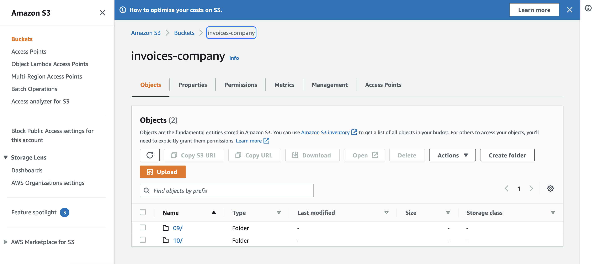
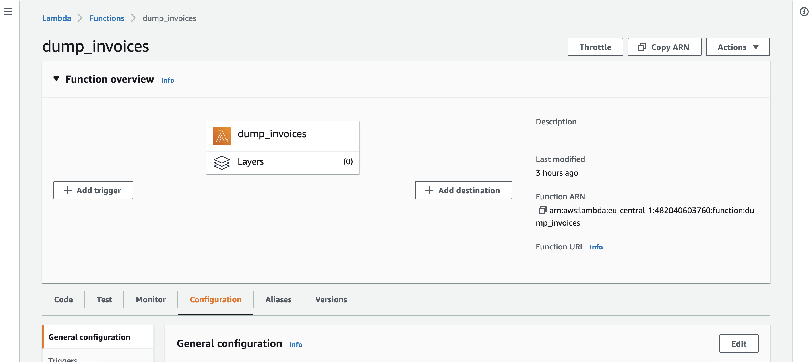
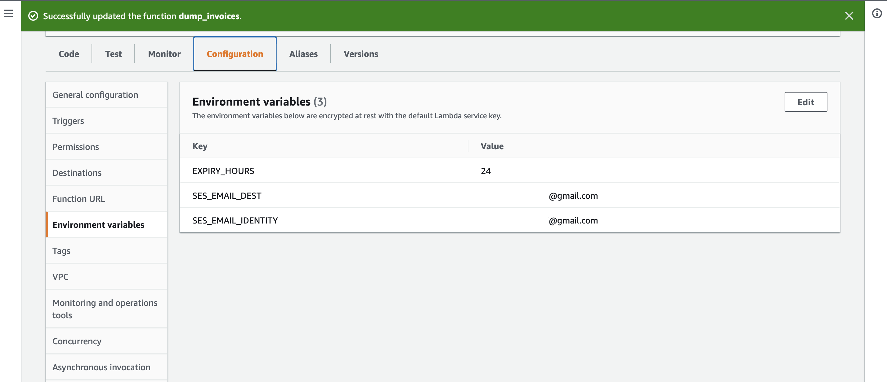
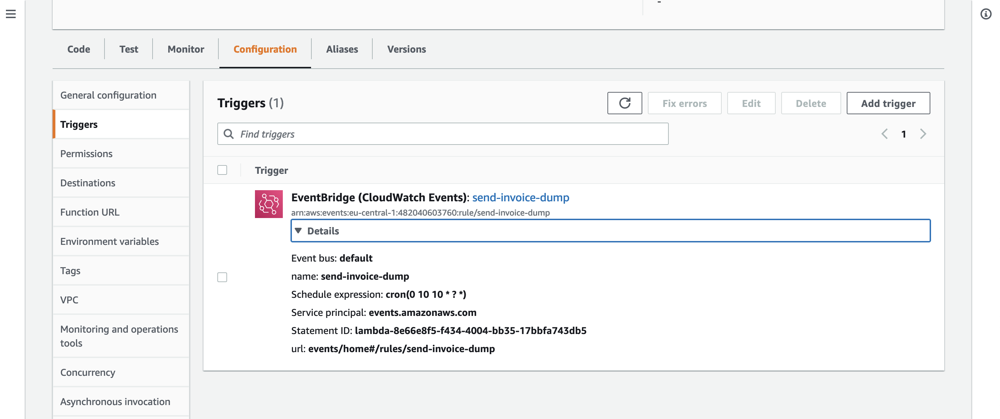

# Automatyzacja procesu wysyłania dokumentów do rozliczeń

## Jak to działa?
Dokumenty gromadzone w podkatalogu bucketa (podkatalogi o nazwach 01-12 dla każdego miesiąca) usługi **S3** są o wskazanej porze, w określonym dniu miesiąca  kompresowane do formatu ZIP oraz tworzony jest URL zawierający token o określonym czasie ważności.  Następnie ten link wysyłany jest przy użyciu usługi **SES (Simple Email Service)**.

Kod funkcji AWS Lambda dostępny jest <a href='lambda_function.py'>tutaj</a>.

## Tworzymy w **S3** bucket, a w nim podkatalogi z numerami miesięcy od 01-12

## Tworzymy funkcję w **AWS Lambda**

## Należy pamiętać o konfiguracji (nie trzymamy parametrów, nazw użytkowników, haseł w kodzie)

## A także dodajemy trigger, który będzie wyzwalał wykonanie funkcji AWS Lambda zgodnie ze zdefiniowanym harmonogramem na wzór crontab

